# 🐘 数据库系统作业

  

<!-- 课程基本信息卡片 -->

| 课程名称 | 授课教师 | 学生姓名 | 学号 | 班级 |
| :--- | :--- | :--- | :--- | :--- |
| **数据库系统原理** | 袁柳 | 李子豪 | 42412133 | 软工2401 |

  
  
  

---

## 🛠️ 技术栈与工具
*   **DBMS**: PostgreSQL 15.x / 16.x
*   **客户端**: `psql` (CLI), pgAdmin 4, DataGrip
*   **辅助工具**: Docker (用于隔离实验环境), Git
*   **特性探索**: 计划学习 JSONB 类型、存储过程以及全文检索功能。

---

## 📮 联系方式
- **Email**: [gskyer.sky@gmail.com](mailto:gskyer.sky@gmail.com)
- **GitHub**: [@AstreoX](https://github.com/AstreoX)

<i>Last Updated: 2026-03-30</i>

