# 第三章作业

> **运行环境**：[db-book.com University SQL.js](https://db-book.com/university-lab-dir/sqljs.html)（SQLite 实现，University 预置数据库）  
> **截图说明**：所有截图由 Playwright 自动化脚本在真实浏览器中执行后截取，截图内容为页面完整输出。

---

## 一、教材例题（Chapter 3）

### 3.3 SQL 查询基本结构

#### 3.3.1 单表查询

**3.3.1-1**（p40）查询所有教师的姓名

```sql
select name
from instructor;
```

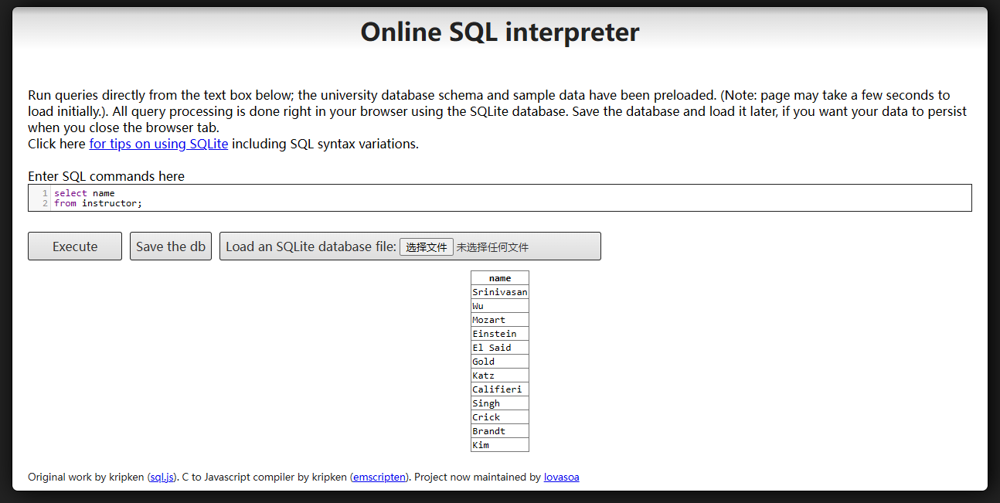

---

**3.3.1-2**（p40）查询所有教师所属的系（含重复）

```sql
select dept_name
from instructor;
```

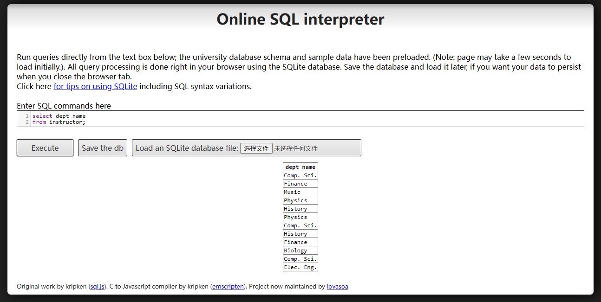

---

**3.3.1-3**（p41）使用 `DISTINCT` 去重，查询所有系名

```sql
select distinct dept_name
from instructor;
```

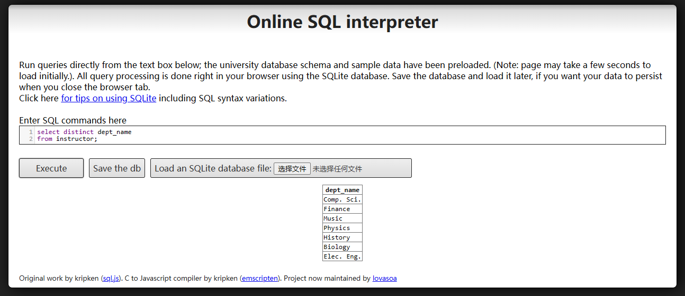

---

**3.3.1-4**（p41）使用 `ALL` 关键字显式保留重复（默认行为）

```sql
select all dept_name
from instructor;
```

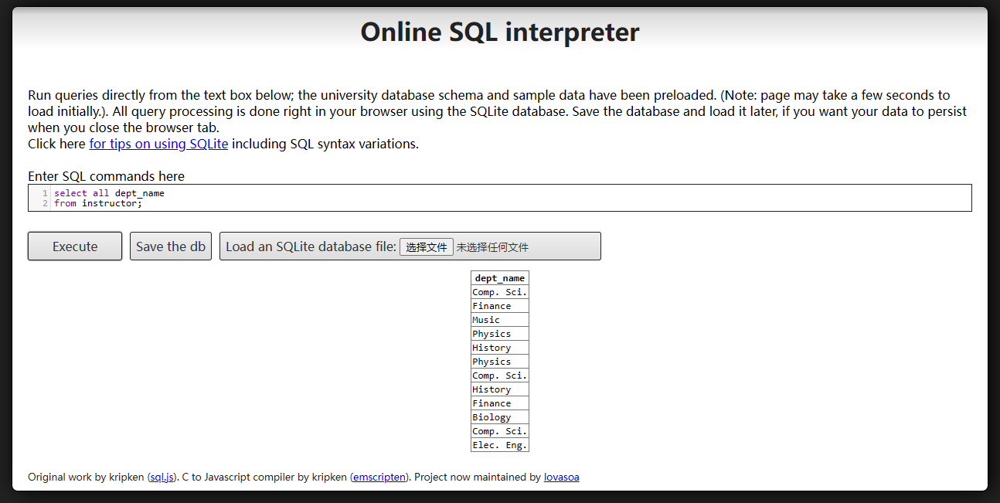

---

**3.3.1-5**（p41）在 `SELECT` 子句中使用算术表达式，将工资乘以 1.1

```sql
select ID, name, dept_name, salary * 1.1
from instructor;
```

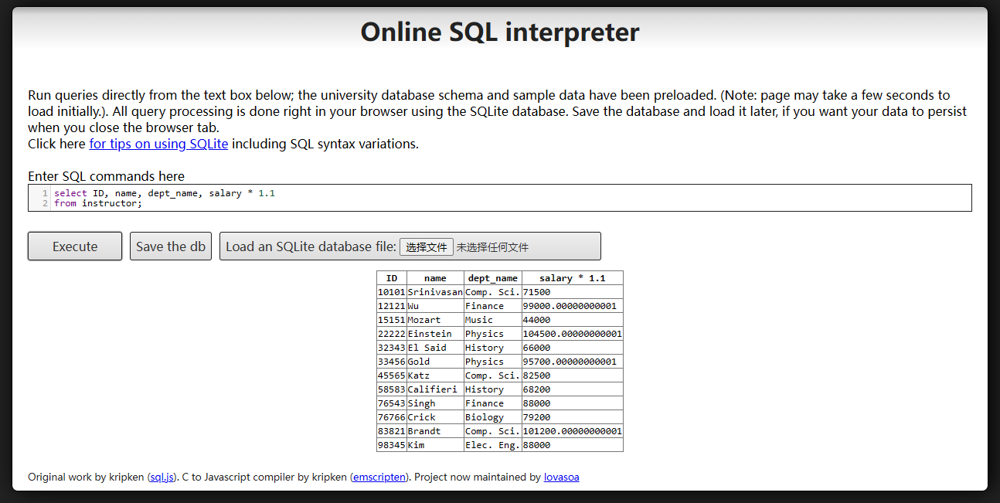

---

**3.3.1-6**（p42）使用 `WHERE` 子句，查询计算机系中工资超过 70000 的教师

```sql
select name
from instructor
where dept_name = 'Comp. Sci.' and salary > 70000;
```

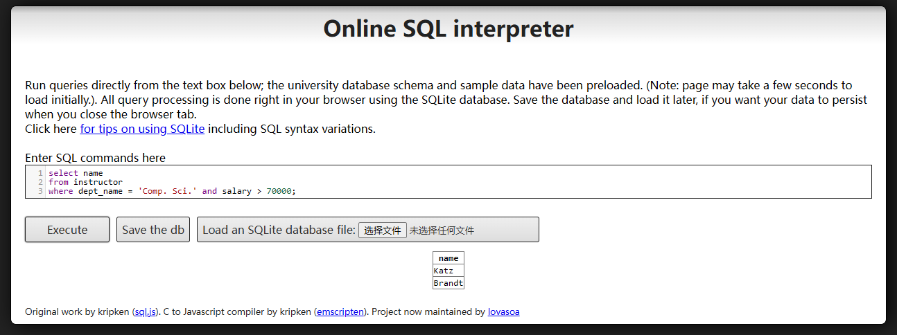

---

#### 3.3.2 多表查询（笛卡尔积）

**3.3.2-1**（p42）连接 `instructor` 与 `department`，查询教师姓名及其系楼

```sql
select name, instructor.dept_name, building
from instructor, department
where instructor.dept_name = department.dept_name;
```

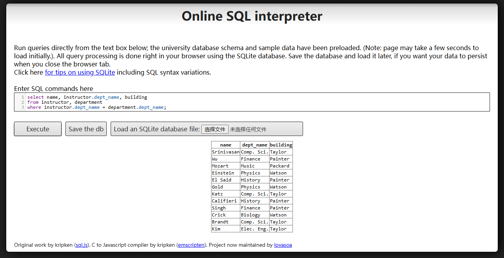

---

**3.3.2-2**（p44）连接 `instructor` 与 `teaches`，查询教师姓名与授课课程

```sql
select name, course_id
from instructor, teaches
where instructor.ID = teaches.ID;
```

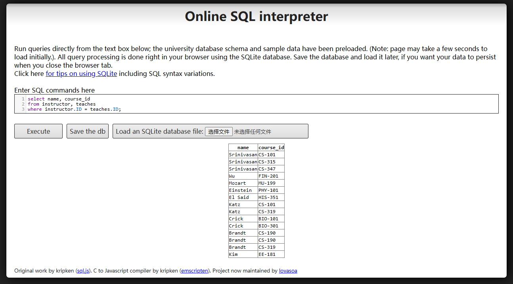

---

**3.3.2-3**（p45）在 3.3.2-2 基础上增加系名过滤，仅查询计算机系教师

```sql
select name, course_id
from instructor, teaches
where instructor.ID = teaches.ID and instructor.dept_name = 'Comp. Sci.';
```

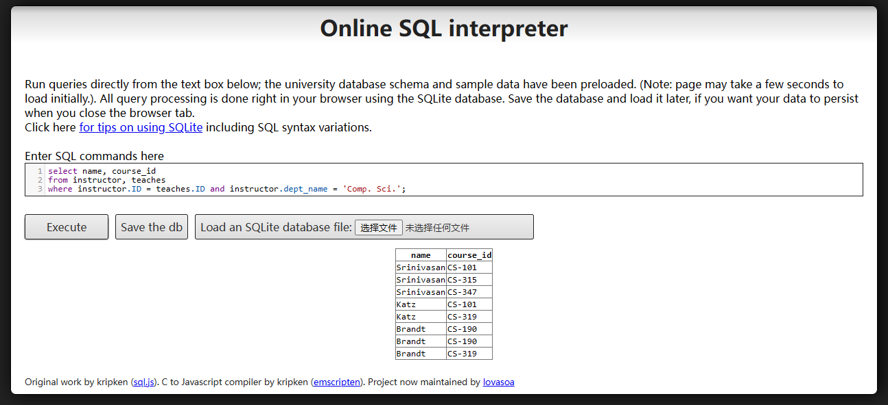

---

### 3.4 附加操作

#### 3.4.1 AS 子句（重命名）

**3.4.1-1**（p47）用 `AS` 对列重命名

```sql
select name as instructor_name, course_id
from instructor, teaches
where instructor.ID = teaches.ID;
```


---

**3.4.1-2**（p47）用 `AS` 对表重命名（表别名）

```sql
select T.name, S.course_id
from instructor as T, teaches as S
where T.ID = S.ID;
```

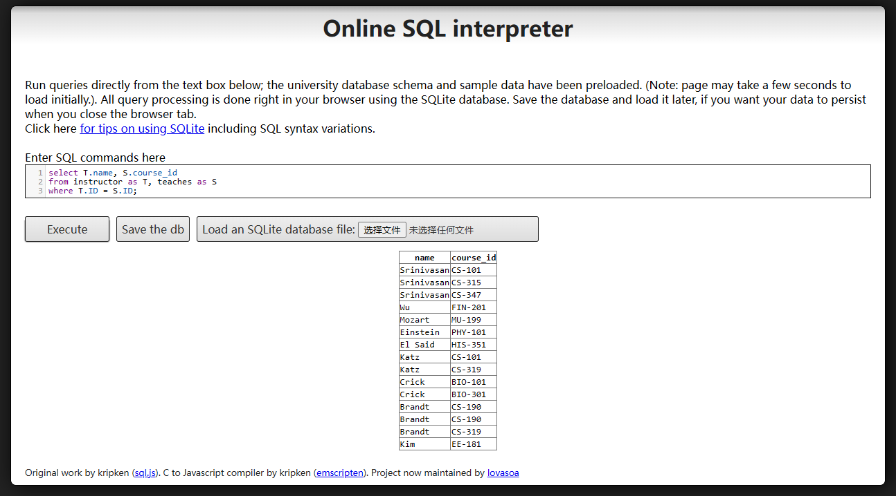

---

**3.4.1-3**（p47）自连接：查询工资高于 Biology 系任意教师的教师姓名

```sql
select distinct T.name
from instructor as T, instructor as S
where T.salary > S.salary and S.dept_name = 'Biology';
```

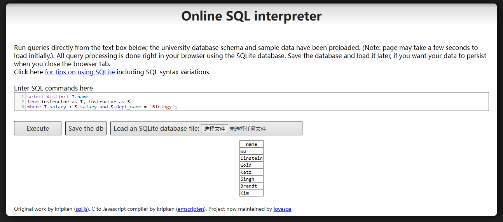

---

#### 3.4.2 LIKE 字符串匹配

**3.4.2-1**（p48）查询楼名包含 "Watson" 的系

```sql
select dept_name
from department
where building like '%Watson%';
```

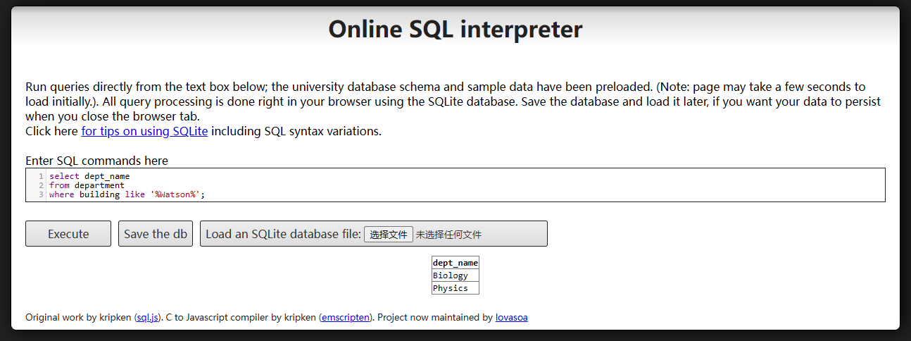

---

#### 3.4.3 星号（\*）选取所有列

**3.4.3-1**（p48）使用 `instructor.*` 选取 instructor 的全部列

```sql
select instructor.*
from instructor, teaches
where instructor.ID = teaches.ID;
```

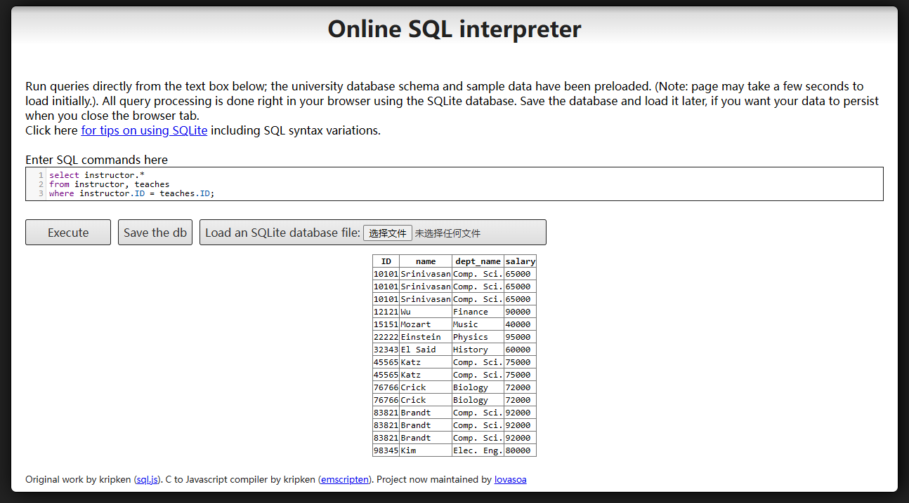

---

#### 3.4.4 ORDER BY 排序

**3.4.4-1**（p48）查询 Physics 系教师，按姓名升序排列

```sql
select name
from instructor
where dept_name = 'Physics'
order by name;
```

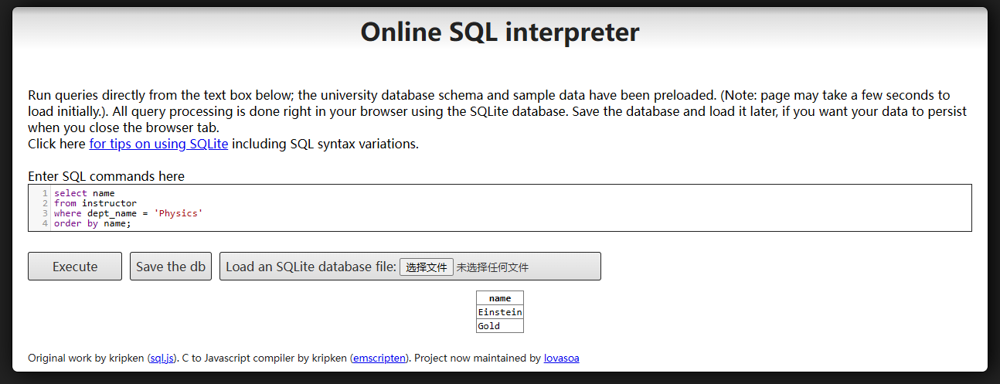

---

**3.4.4-2**（p49）查询所有教师，先按工资降序、再按姓名升序排列

```sql
select *
from instructor
order by salary desc, name asc;
```

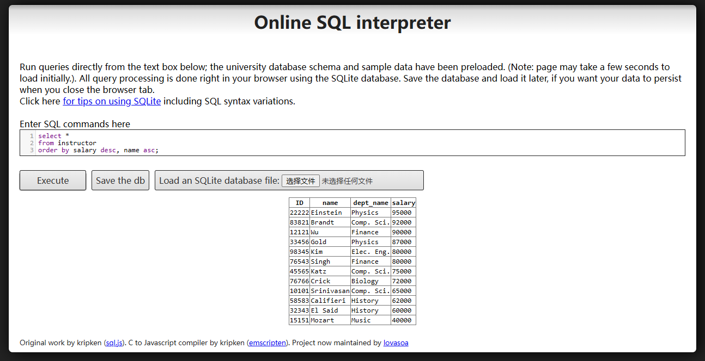

---

#### 3.4.5 BETWEEN / 行值比较

**3.4.5-1**（p49）用 `BETWEEN` 查询工资在 90000 到 100000 之间的教师

```sql
select name
from instructor
where salary between 90000 and 100000;
```


---

**3.4.5-2**（p49）与 3.4.5-1 等价，用比较运算符改写

```sql
select name
from instructor
where salary <= 100000 and salary >= 90000;
```

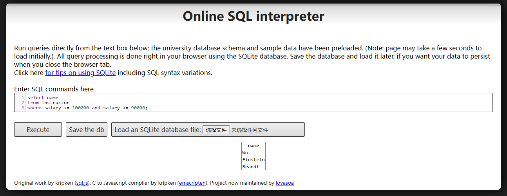

---

**3.4.5-3**（p49）用 `WHERE` 条件替代多表连接的等值过滤

```sql
select name, course_id
from instructor, teaches
where instructor.ID = teaches.ID and dept_name = 'Biology';
```

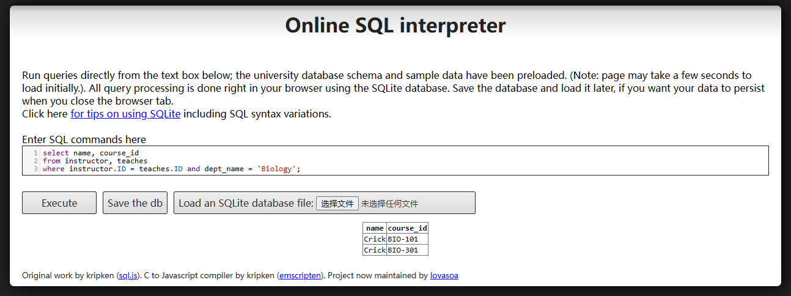

---

**3.4.5-4**（p49）使用行值构造器（row value constructor）进行多列等值比较

```sql
select name, course_id
from instructor, teaches
where (instructor.ID, dept_name) = (teaches.ID, 'Biology');
```

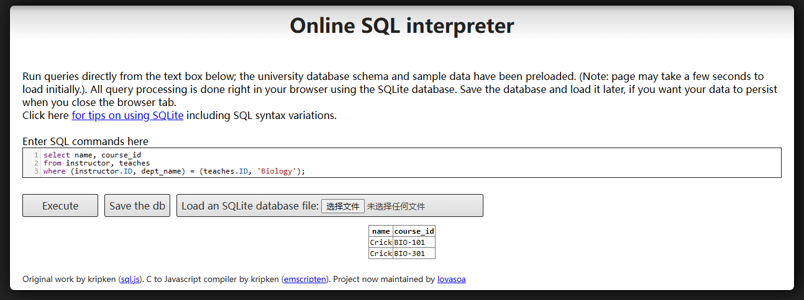

---

### 3.5 集合运算

以下查询用到的两个基础集合（Fall 2017 / Spring 2018 开设的课程）：

**3.5-1**（p49）Fall 2017 开设的课程

```sql
select course_id
from section
where semester = 'Fall' and year = 2017;
```

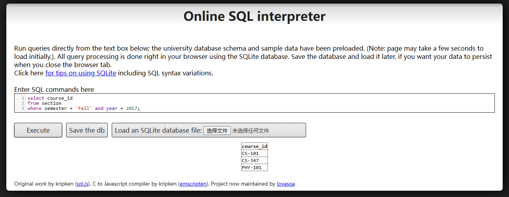

---

**3.5-2**（p50）Spring 2018 开设的课程

```sql
select course_id
from section
where semester = 'Spring' and year = 2018;
```

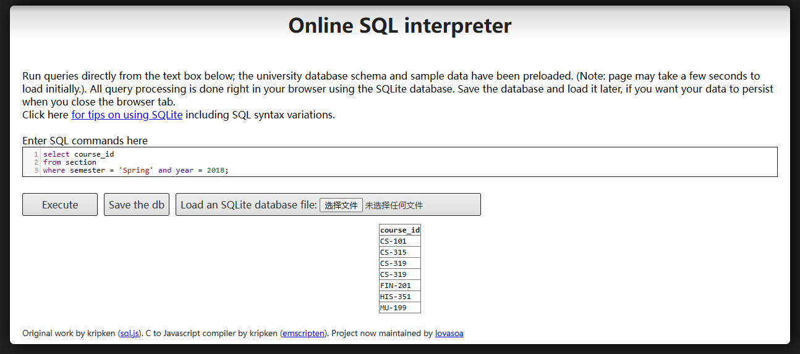

---

#### 3.5.1 UNION（并集）

**3.5.1-1**（p50）两个学期开设课程的并集（自动去重）

> SQLite 不支持复合查询两侧的最外层括号，已去除。

```sql
-- 课本原句
(select course_id from section where semester = 'Fall' and year = 2017)
union
(select course_id from section where semester = 'Spring' and year = 2018);
```

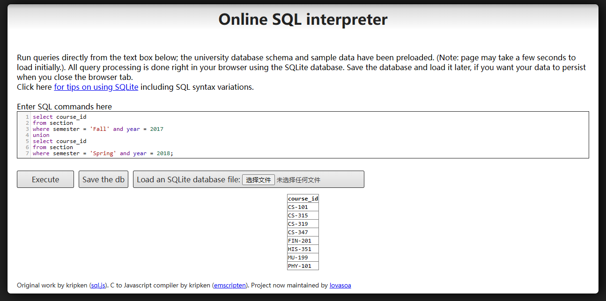

---

**3.5.1-2**（p50）`UNION ALL`：保留重复行的并集

```sql
-- 课本原句
(select course_id from section where semester = 'Fall' and year = 2017)
union all
(select course_id from section where semester = 'Spring' and year = 2018);
```

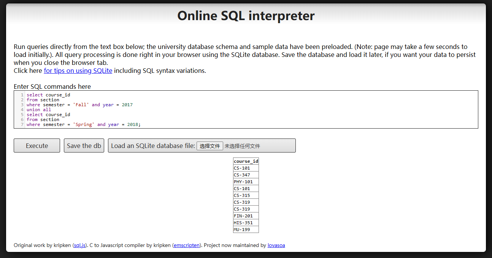

---

#### 3.5.2 INTERSECT（交集）

**3.5.2-1**（p51）两个学期都开设的课程（去重交集）

```sql
-- 课本原句
(select course_id from section where semester = 'Fall' and year = 2017)
intersect
(select course_id from section where semester = 'Spring' and year = 2018);
```

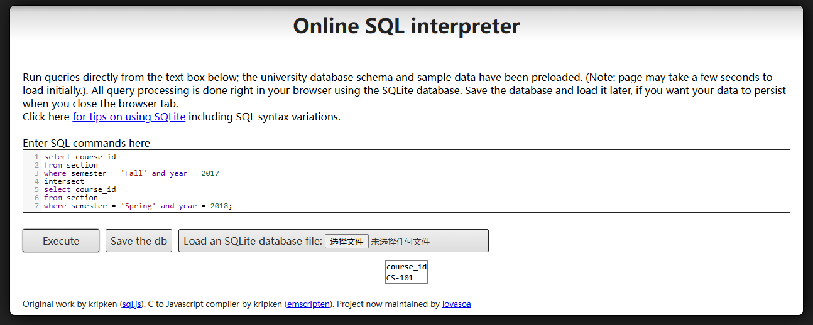

---

**3.5.2-2**（p51）`INTERSECT ALL`：保留重复行的交集

> SQLite 不支持 `INTERSECT ALL`，已用 `ROW_NUMBER()` 窗口函数模拟多重集语义。

```sql
-- 课本原句
(select course_id from section where semester = 'Fall' and year = 2017)
intersect all
(select course_id from section where semester = 'Spring' and year = 2018);
```

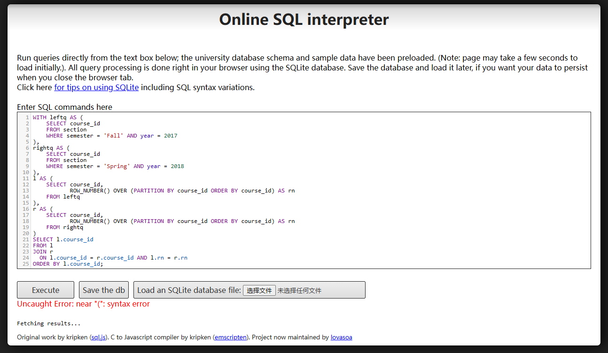

---

#### 3.5.3 EXCEPT（差集）

**3.5.3-1**（p51）Fall 2017 有、Spring 2018 没有的课程

```sql
-- 课本原句
(select course_id from section where semester = 'Fall' and year = 2017)
except
(select course_id from section where semester = 'Spring' and year = 2018);
```

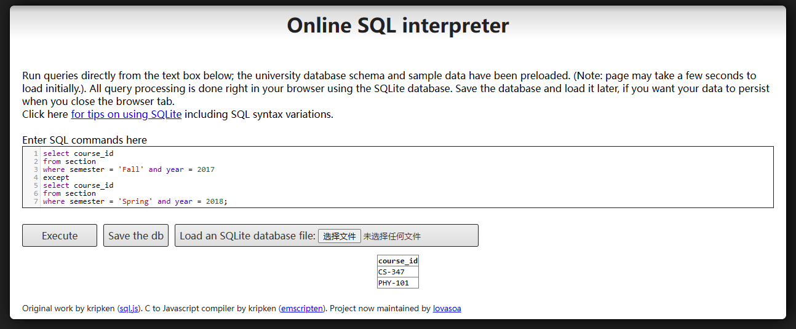

---

**3.5.3-2**（p52）`EXCEPT ALL`：保留重复行的差集

> SQLite 不支持 `EXCEPT ALL`，已用 `ROW_NUMBER()` 窗口函数模拟多重集语义。

```sql
-- 课本原句
(select course_id from section where semester = 'Fall' and year = 2017)
except all
(select course_id from section where semester = 'Spring' and year = 2018);
```

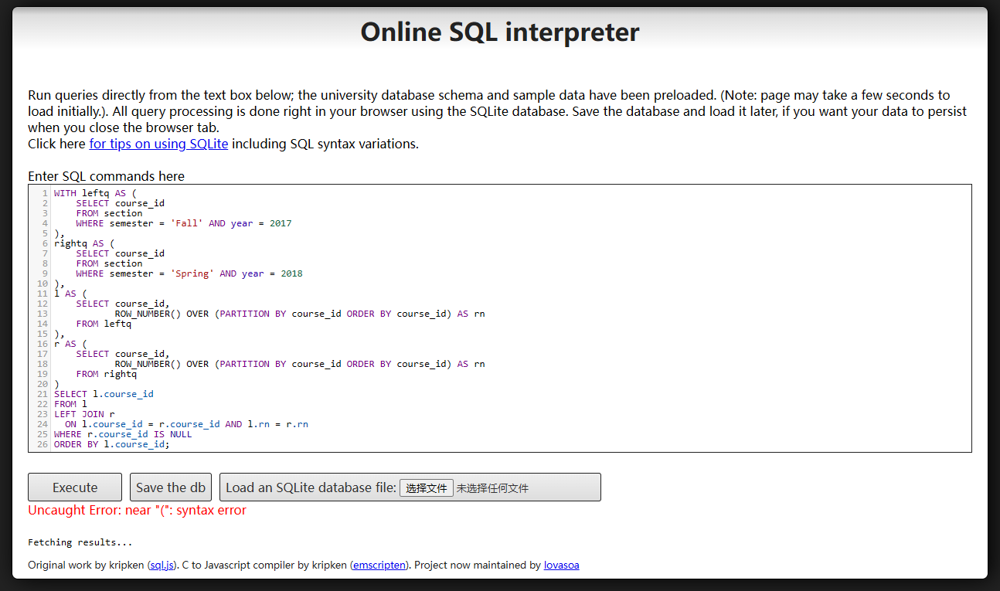

---

### 3.6 NULL 值

**3.6-1**（p53）查询工资为 NULL 的教师（University 数据中不存在，结果为空）

```sql
select name
from instructor
where salary is null;
```

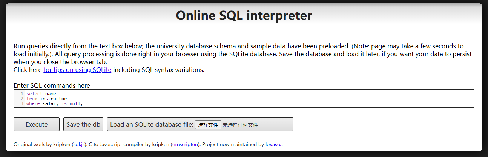

---

**3.6-2**（p53）检验 UNKNOWN（三值逻辑）

> SQLite 不支持 `IS UNKNOWN`，用 `(expr) IS NULL` 等价替换。

```sql
-- 课本原句
select name from instructor where salary > 10000 is unknown;
```

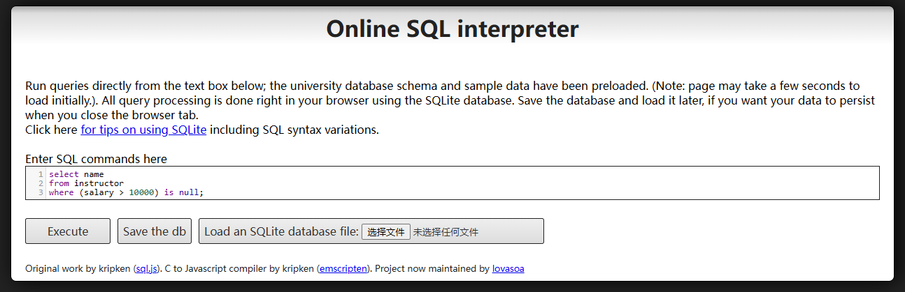

---

### 3.7 聚集函数

#### 3.7.1 基本聚集

**3.7.1-1**（p53）计算机系教师的平均工资

```sql
select avg(salary)
from instructor
where dept_name = 'Comp. Sci.';
```

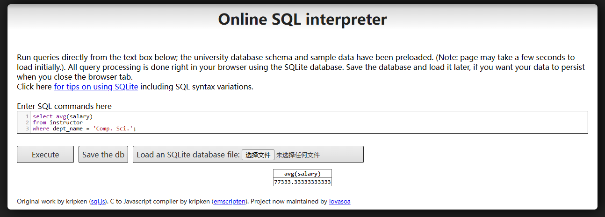

---

**3.7.1-2**（p54）同上，对结果列使用 `AS` 重命名

```sql
select avg(salary) as avg_salary
from instructor
where dept_name = 'Comp. Sci.';
```

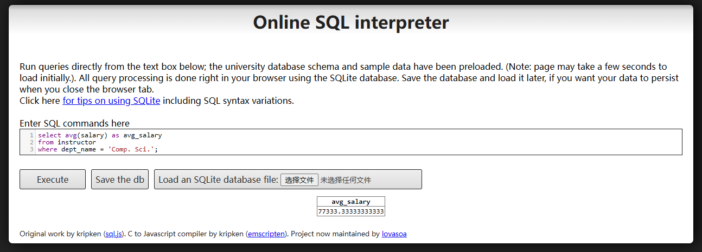

---

**3.7.1-3**（p54）统计 Spring 2018 授课教师的不重复人数

```sql
select count(distinct ID)
from teaches
where semester = 'Spring' and year = 2018;
```

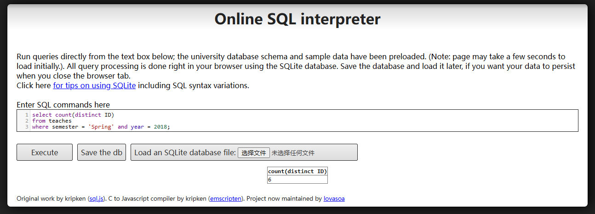

---

**3.7.1-4**（p54）统计课程总数

```sql
select count(*)
from course;
```

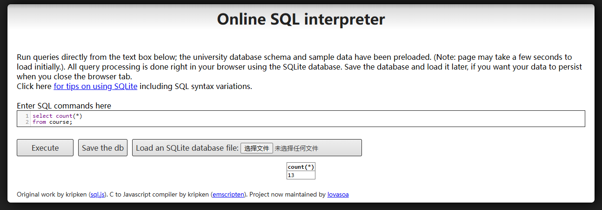

---

#### 3.7.2 GROUP BY 分组聚集

**3.7.2-1**（p54）按系分组，计算每个系的平均工资

```sql
select dept_name, avg(salary) as avg_salary
from instructor
group by dept_name;
```

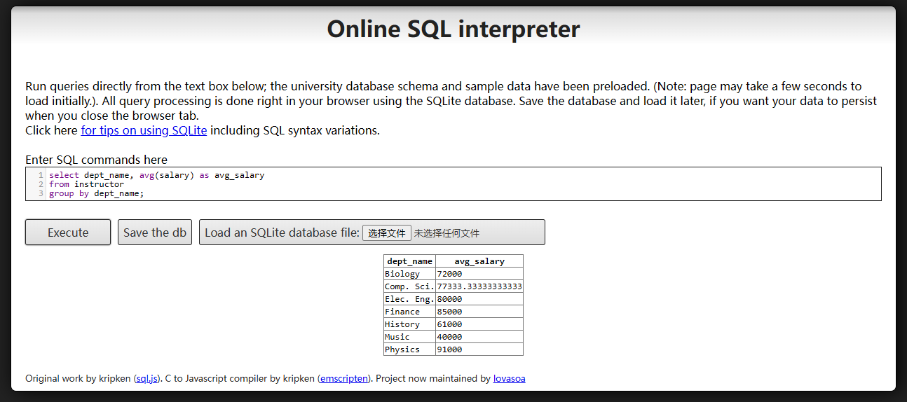

---

**3.7.2-2**（p55）全校教师平均工资（无 GROUP BY）

```sql
select avg(salary)
from instructor;
```

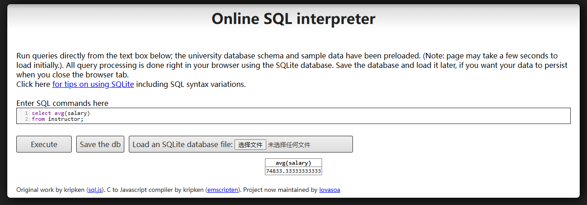

---

**3.7.2-3**（p55）统计 Spring 2018 每个系的授课教师人数

```sql
select dept_name, count(distinct instructor.ID) as instr_count
from instructor, teaches
where instructor.ID = teaches.ID and
      semester = 'Spring' and year = 2018
group by dept_name;
```

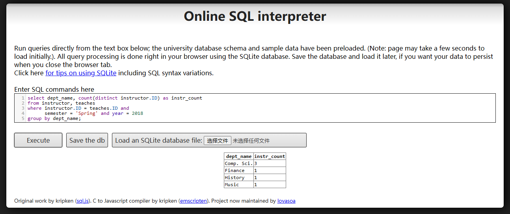

---

## 二、课后练习题

### 练习 3.1

**3.1-a** 查询计算机系中学分为 3 的所有课程名称

```sql
select title
from course
where dept_name = 'Comp. Sci.' and credits = 3;
```

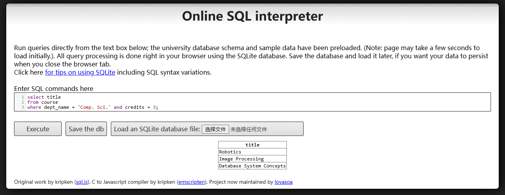

---

**3.1-b** 查询选修了 Einstein 老师课程的所有学生 ID

```sql
select distinct takes.ID
from takes, instructor, teaches
where takes.course_id = teaches.course_id and
      takes.sec_id = teaches.sec_id and
      takes.semester = teaches.semester and
      takes.year = teaches.year and
      teaches.id = instructor.id and
      instructor.name = 'Einstein';
```

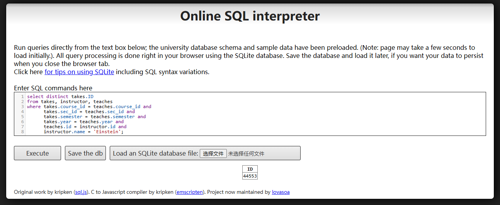

---

**3.1-c** 查询教师中的最高工资

```sql
select max(salary)
from instructor;
```

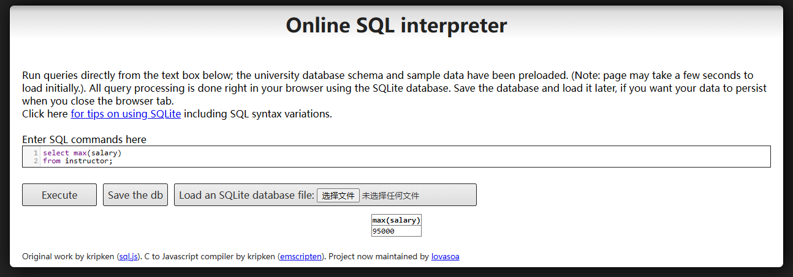

---

**3.1-d** 查询工资最高的教师 ID 和姓名

```sql
select ID, name
from instructor
where salary = (select max(salary) from instructor);
```

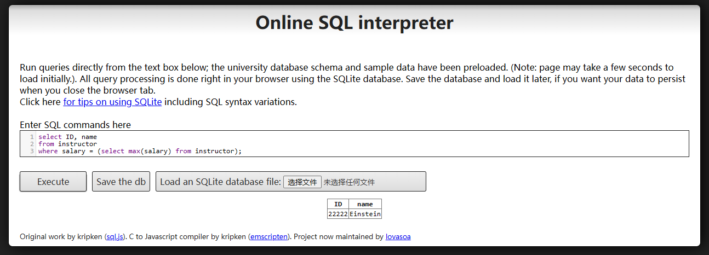

---

**3.1-e（主解）** 用相关子查询，统计 Fall 2017 每门课每节的选课人数

```sql
select course_id, sec_id,
       (select count(ID)
        from takes
        where takes.year = section.year
          and takes.semester = section.semester
          and takes.course_id = section.course_id
          and takes.sec_id = section.sec_id) as enrollment
from section
where semester = 'Fall'
  and year = 2017;
```

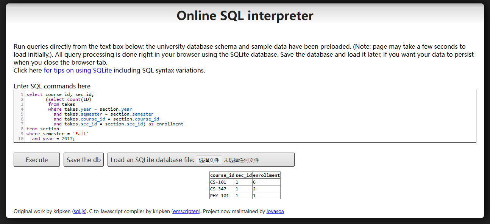

---

**3.1-e（替代解）** 用 GROUP BY 改写，与主解结果等价

```sql
select takes.course_id, takes.sec_id, count(ID)
from section, takes
where takes.course_id = section.course_id
  and takes.sec_id = section.sec_id
  and takes.semester = section.semester
  and takes.year = section.year
  and takes.semester = 'Fall'
  and takes.year = 2017
group by takes.course_id, takes.sec_id;
```

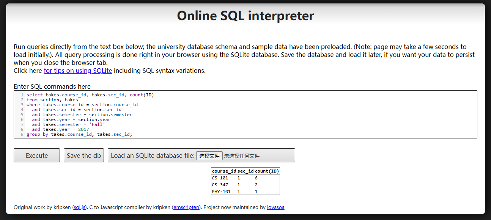

---

**3.1-f** 查询 Fall 2017 选课人数最多的课程的最大选课数

```sql
select max(enrollment)
from (select count(ID) as enrollment
      from section, takes
      where takes.year = section.year
        and takes.semester = section.semester
        and takes.course_id = section.course_id
        and takes.sec_id = section.sec_id
        and takes.semester = 'Fall'
        and takes.year = 2017
      group by takes.course_id, takes.sec_id);
```

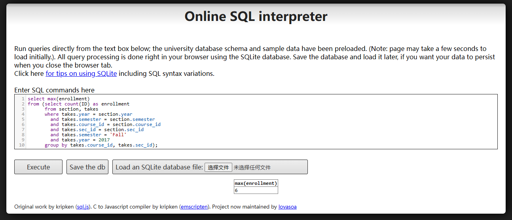

---

**3.1-g** 查询 Fall 2017 选课人数最多的课程编号和节次（使用 WITH 子句）

```sql
with sec_enrollment as (
    select takes.course_id, takes.sec_id, count(ID) as enrollment
    from section, takes
    where takes.year = section.year
      and takes.semester = section.semester
      and takes.course_id = section.course_id
      and takes.sec_id = section.sec_id
      and takes.semester = 'Fall'
      and takes.year = 2017
    group by takes.course_id, takes.sec_id
)
select course_id, sec_id
from sec_enrollment
where enrollment = (select max(enrollment) from sec_enrollment);
```

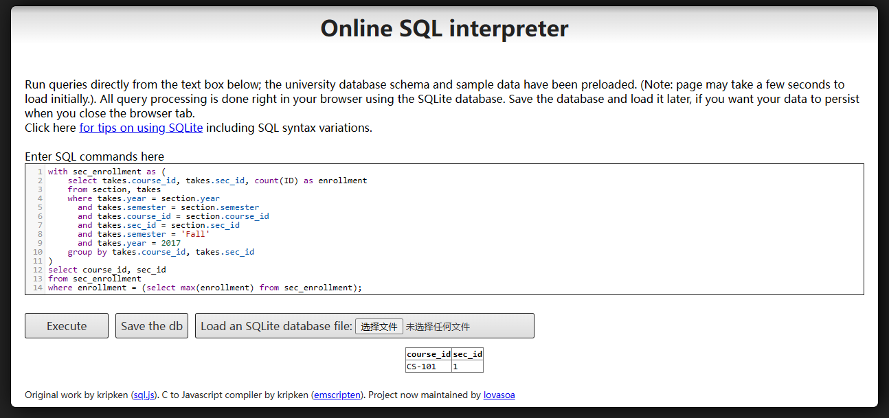

---

### 练习 3.2

> 本题需要额外的 `grade_points` 表（映射成绩字母到绩点），脚本在每次执行前自动建表并插入数据：
> `A=10, B=8, C=6, D=4, F=0`

**3.2-a** 计算学生 12345 的加权总学分绩（分子）

```sql
select sum(credits * points)
from takes, course, grade_points
where takes.grade = grade_points.grade
  and takes.course_id = course.course_id
  and ID = '12345';
```

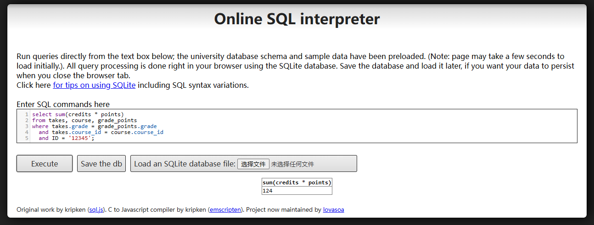

---

**3.2-b** 计算学生 12345 的 GPA（加权平均绩点）

```sql
select sum(credits * points) / sum(credits) as GPA
from takes, course, grade_points
where takes.grade = grade_points.grade
  and takes.course_id = course.course_id
  and ID = '12345';
```

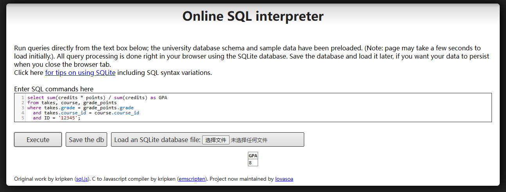

---

**3.2-c** 计算所有学生的 GPA

```sql
select ID, sum(credits * points) / sum(credits) as GPA
from takes, course, grade_points
where takes.grade = grade_points.grade
  and takes.course_id = course.course_id
group by ID;
```

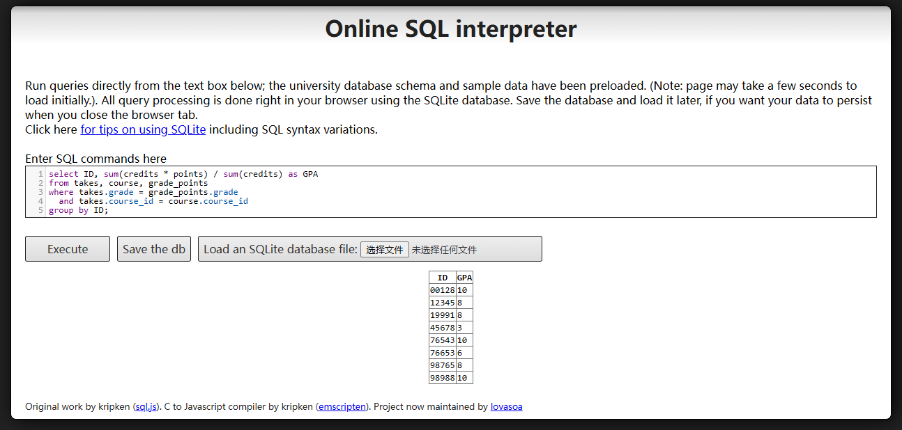

---

### 练习 3.3（DML）

**3.3-a** 将计算机系所有教师工资提高 10%（截图展示执行后的工资）

```sql
update instructor
set salary = salary * 1.10
where dept_name = 'Comp. Sci.';
```

> 截图为 UPDATE 后执行验证查询 `SELECT ID, name, salary FROM instructor WHERE dept_name = 'Comp. Sci.' ORDER BY ID` 的结果。

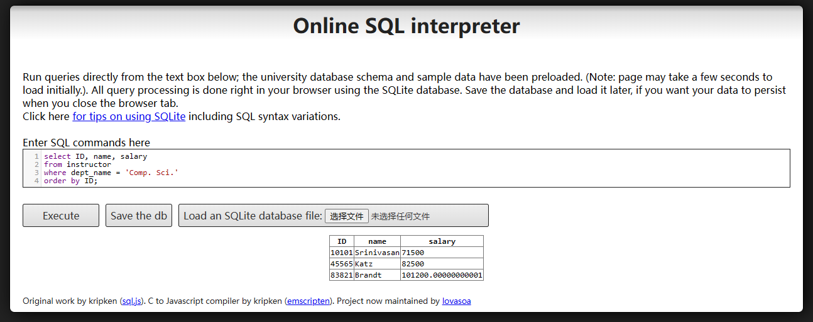

---

**3.3-b** 删除没有在任何 section 中开设的课程

```sql
delete from course
where course_id not in
      (select course_id from section);
```

> 截图为 DELETE 后执行验证查询（查询是否还有未开设的课程，结果应为空）的结果。

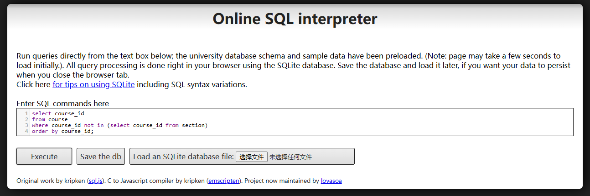

---

**3.3-c** 将修读学分超过 100 的学生插入 instructor 表

> 课本原句使用 `salary = 10000`，但 `instructor` 表有约束 `CHECK (salary > 29000)`，  
> 已将工资改为 `30000` 以满足约束。

```sql
-- 课本原句（salary = 10000 违反约束）
insert into instructor
select ID, name, dept_name, 10000
from student
where tot_cred > 100;

-- 实际执行（salary 改为 30000）
insert into instructor
select ID, name, dept_name, 30000
from student
where tot_cred > 100;
```

> 截图为 INSERT 后执行验证查询（查询新插入行）的结果。

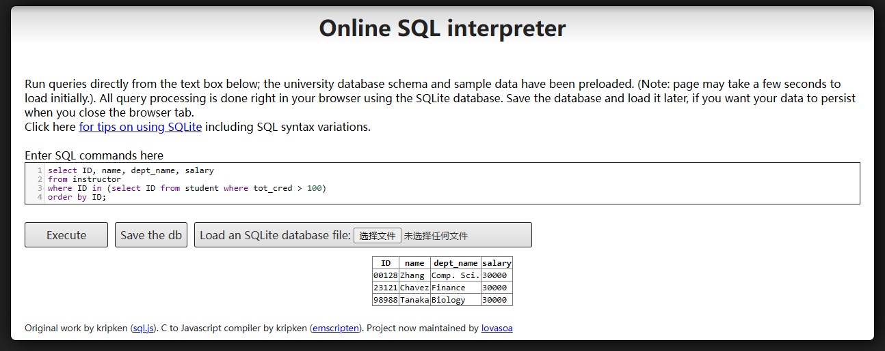
